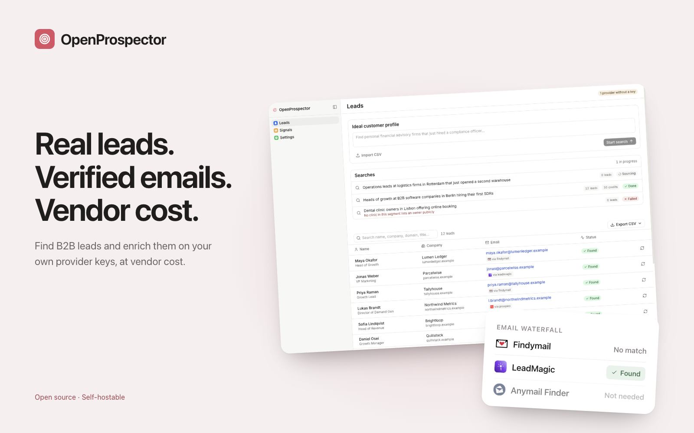

# OpenProspector: The Open-Source Clay Alternative for Lead Enrichment

[](https://app.clawnify.com/deploy?repo=clawnify/OpenProspector)

Find B2B leads and enrich them with **your own provider keys** — at vendor cost, with no per-lead markup. An open-source app template provided by [Clawnify.com](https://clawnify.com).

Built with **React + Tailwind** on a **Hono API** and a **SQLite** database. Path-based routing, UUID keys, a dark mode that follows the OS, and a full OpenAPI surface so agents can drive it.

## What Is It?

Lead-enrichment SaaS resells contact data. Clay, Apollo, and the newer AI prospecting tools buy credits wholesale from a handful of data vendors and charge you a marked-up per-lead price on top — typically **$0.10–$0.15 per lead**.

OpenProspector inverts that. You bring your own vendor keys, you pay the vendor directly, and the app does the part that actually carries the value: **orchestrating the waterfall**. Try the cheapest provider first, validate the result, fall through to the next one only if it missed, never buy the same person twice.

The savings are not theoretical:

| | Per-lead SaaS | OpenProspector (BYO key) |
|---|---|---|
| Cost per verified email | ~$0.12 | **~$0.02** |
| Re-checking a lead you already own | Full price again | **Free** (cached) |
| Where your contact data lives | Their cloud | Your database |
| Provider order | Fixed | Yours to configure |

> **Where this *doesn't* win.** Most vendors sell credits on a monthly floor — Findymail's entry plan is $99/mo for 5,000 credits. Below roughly **800 leads/month**, a usage-priced SaaS is genuinely cheaper. This template is for teams doing real volume.

## Provider Roadmap

Each field has its own independently-ordered waterfall. The order below is the shipping default; **you can reorder any of it in the UI**, and you should — the optimal order depends on which vendors you already pay for and how your ICP resolves.

### Email waterfall

| # | Provider | Status |
|---|----------|--------|
| 1 | **Findymail** | ✅ Shipped |
| 2 | LeadMagic | Planned |
| 3 | Wiza | Planned |
| 4 | People Data Labs | Planned |
| 5 | Prospeo | Planned |

### Phone waterfall

| # | Provider | Status |
|---|----------|--------|
| 1 | Bytemine | Planned |
| 2 | People Data Labs | Planned |
| 3 | LeadMagic | Planned |
| 4 | Wiza | Planned |
| 5 | Forager | Planned |
| 6 | Prospeo | Planned |
| 7 | ContactOut | Planned |
| 8 | Zeliq | Planned |

Phone credits cost meaningfully more than email — Findymail, for instance, prices a phone number at **10×** an email — which is why the phone waterfall runs deeper before giving up, and why ordering it well matters more.

### Adding a provider

An adapter is one file. Implement `EnrichProvider` in `src/server/providers/`, add it to `REGISTRY`, and it appears in the UI with its own key field and reorder controls:

```ts
export const MyProvider: EnrichProvider = {
  id: "myvendor",
  label: "My Vendor",
  fields: ["email"],
  secretName: "MYVENDOR_API_KEY",   // never a literal key in app code
  signupUrl: "https://myvendor.com/api-keys",
  requirements: () => ["fullName", "domain"],
  async find(field, input, apiKey) { /* → EnrichResult */ },
};
```

Adapters are pure request/response wrappers with no app coupling — no database, no caching, no ordering logic. The runner owns all of that, which is what keeps the registry cheap to extend.

## How a Search Runs

Sourcing and enrichment are deliberately different jobs, and this app only does one of them.

1. **You describe an ICP** — "marketing agencies in Amsterdam, reach the creative director".
2. **Your agent sources.** The app hands the search to your agent, which researches the live web — maps and review sites, job boards, funding news, professional profiles — and posts back a named person, a company domain, and *one line of evidence* for why each lead qualifies. That work needs judgment and a real browser, so it does not run inside the app.
3. **The app enriches.** Every sourced lead goes through the provider waterfall below to resolve a verified email or phone, on your keys, at vendor cost.
4. **You export.** CSV, or a POST to your CRM or sequencer.

Progress shows up on the search itself — sourcing, enriching, done — including a **stalled** state if the agent stops reporting, so a search that died is never mistaken for one still working.

If the app can't reach your agent, it hands you the brief to paste into your agent's chat instead. The search is saved either way, and can be retried.

## How the Waterfall Works

1. **Cache first.** A normalized `(field, name, domain)` key is checked before any vendor call. A hit costs nothing.
2. **Skip what can't help.** Providers with no API key, or missing the inputs they need, are skipped without spending — and *recorded* as skipped, so you can see exactly why coverage looked thin.
3. **First verified result wins.** An unverified value is kept as a fallback but does **not** stop the search, and is never cached — so a better-configured waterfall can retry it later.
4. **Everything is logged.** Every attempt writes provider, outcome, credits, and latency to an append-only ledger. "Why did this lead resolve this way, and what did it cost?" is always answerable.

Cached values expire after **90 days**. Contact data decays as people change jobs, and an unbounded cache would serve confidently-"verified" dead addresses straight into your bounce rate.

## Features

- **Agent-run sourcing** — describe an ICP and your agent researches the live web; progress and failures surface on the search
- **Configurable waterfalls** — independent provider order per field, editable in the UI
- **Enrichment cache** — never buy the same contact twice, with a staleness cap
- **Cost ledger** — per-provider outcome and credit breakdown; spend is read back from the ledger, so a crashed job can't under-report
- **Provider attribution** — every enriched cell shows which vendor produced it
- **CSV import** — bring a list you already have; column headers are matched loosely
- **Batch enrichment** — large lists process as chained background jobs, safe against redelivery
- **Full OpenAPI** — `/api/openapi.json` and `/llms.txt` for agent-driven use
- **Dark mode** that follows the OS

## What This Deliberately Does Not Do

**It does not send email.** No sequencer, no SMTP, no "enroll 20 leads" button — not even bring-your-own.

That is a considered decision, not a missing feature. Cold-email sending at volume is a deliverability and compliance problem (CAN-SPAM, GDPR) that belongs in a tool you have configured, warmed, and are accountable for. OpenProspector's job ends at a verified, attributed contact record; export it to your CRM or your own sequencer and send from there.

## Quickstart

```bash
git clone https://github.com/clawnify/OpenProspector.git
cd open-prospector
pnpm install

cp .dev.vars.example .dev.vars   # add whichever provider keys you have
pnpm dev                          # UI on :5175, API on :8789
```

Every provider is optional. With no keys at all the app still runs — the waterfall records `unconfigured` for each vendor so you can see what a key would buy you.

```bash
pnpm test        # waterfall ordering, eligibility, cache and TTL behaviour
pnpm typecheck
pnpm build
```

## API

All list endpoints are paginated (`?page=`, `?limit=`, max 100) and searchable — no endpoint returns an unbounded collection.

| Method | Path | Purpose |
|--------|------|---------|
| `GET` | `/api/providers?credits=true` | Registry, configuration state, remaining balances |
| `PUT` | `/api/waterfall/{field}` | Set provider order for `email` or `phone` |
| `POST` | `/api/runs` | Start a search from an ICP description |
| `GET` | `/api/runs`, `/api/runs/{id}` | List runs; one run with live credit spend |
| `POST` | `/api/runs/{id}/enrich` | Queue enrichment for a run's pending leads |
| `POST` | `/api/leads` | Import leads (CSV or an existing list) |
| `GET` | `/api/leads`, `/api/leads/{id}` | List leads; one lead with its attempt log |
| `POST` | `/api/leads/{id}/enrich` | Enrich one lead (`?refresh=true` to re-buy) |
| `GET` | `/api/export/leads.csv` | Download leads as CSV (bounded; page with `offset`) |
| `POST` | `/api/export/push` | POST leads to a CRM, sequencer, or webhook you control |

**Push safety.** The destination is caller-supplied, so it is validated before anything is sent: **https only**, public hosts only (loopback, private ranges, carrier-grade NAT, IPv6 unique/link-local, `.local`/`.internal`, and cloud metadata addresses are all refused), hop-by-hop and `Host` headers stripped, header-injection attempts dropped, and **redirects refused rather than followed** — a permitted host must not be able to bounce your contact data onward.

## License

MIT — see [LICENSE](LICENSE).
